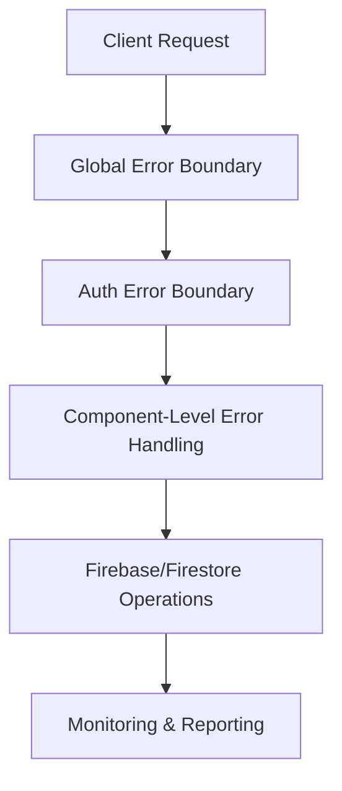

# Error Handling & Reliability Guide

This document provides an overview of the error handling mechanisms and reliability features implemented in the Reality Portal application. Use this as a reference for troubleshooting and understanding how the system handles errors.

## 1. Architecture Overview

Our application implements several layers of error protection:

This multi-layered approach ensures that errors are caught at the appropriate level and handled gracefully.

## 2. Firebase Authentication Fixes

### Key Components:

- **firebase-auth-unified.ts**: Centralized auth interface that works across environments
- **FirebaseAuthContext.tsx**: React context provider with enhanced error handling
- **AuthErrorBoundary.tsx**: Error boundary specific to auth-related errors

### How It Works:

1. Proper environment detection with fallbacks
2. Safe initialization sequence to prevent race conditions
3. Enhanced error handling with specific error types
4. Retry mechanisms with exponential backoff
5. Graceful degradation when auth services are unavailable

## 3. Firestore Data Operations

### Key Components:

- **firestore-utils.ts**: Safe operations with built-in error handling
- **FirestoreError**: Custom error class for improved error context

### Key Features:

- Authentication verification before operations
- Retry mechanisms for transient errors
- Permission error detection and reporting
- Type-safe interfaces for database operations

## 4. Image Loading & Resources

### Key Components:

- **SafeImage.tsx**: Component for handling image loading errors
- **next.config.js**: Enhanced image configuration

### Key Features:

- Automatic retries for failed image loads
- Cache-busting for problematic images
- Fallback placeholders
- Proper domain configuration

## 5. Monitoring System

### Key Components:

- **monitoring.ts**: Centralized error tracking and reporting

### Key Features:

- Global error handlers for uncaught exceptions
- Enhanced logging with context
- Network error monitoring
- Performance monitoring
- Error deduplication

## 6. Deployment Validation

### Key Components:

- **validate-deployment.js**: Pre-deployment validation script

### What It Checks:

- Required environment variables
- Firebase configuration
- File presence and integrity
- TypeScript build validation

## 7. Troubleshooting Common Issues

### Firebase Auth Initialization Failures

**Symptoms:**

- Error in console: "Failed to initialize Firebase auth"
- Authentication state changes not detected

**Solutions:**

1. Check environment variables for Firebase configuration
2. Verify Firebase project settings (Web SDK configuration)
3. Check for circular dependencies in auth-related imports
4. Clear browser localStorage and sessionStorage

### Firestore Permission Errors

**Symptoms:**

- "Missing or insufficient permissions" errors
- Data operations failing

**Solutions:**

1. Verify user is properly authenticated (check auth state)
2. Verify Firestore security rules match your access patterns
3. Use `verifyAuthBeforeDbOperation()` in data operations
4. Check for timing issues with auth state not being ready

### Image Loading Failures

**Symptoms:**

- 400 Bad Request errors for image URLs
- Images not displaying

**Solutions:**

1. Update domains and remotePatterns in next.config.js
2. Use the SafeImage component instead of Next.js Image directly
3. Verify image URLs are correctly formed
4. Check CDN or storage bucket configuration

## 8. Error Recovery Strategies

1. **Auth Errors**: Clear localStorage/sessionStorage and redirect to login
2. **Network Errors**: Implement automatic retries with backoff
3. **UI Errors**: Use fallback components when primary components fail
4. **Data Errors**: Cache last known good state and retry operations

## 9. Development Best Practices

1. Always wrap auth-dependent components with AuthErrorBoundary
2. Use SafeImage for all external images
3. Use the firestore-utils for all Firestore operations
4. Run the validation script before deployment
5. Monitor error logs regularly to catch issues early

## 10. Vercel Deployment Considerations

1. Set all required environment variables in Vercel project settings
2. Use the build:vercel script for Vercel deployments
3. Monitor Vercel deployment logs for initialization errors
4. Configure proper domains for image optimization

---

For additional support or questions about these implementations, contact the development team.
